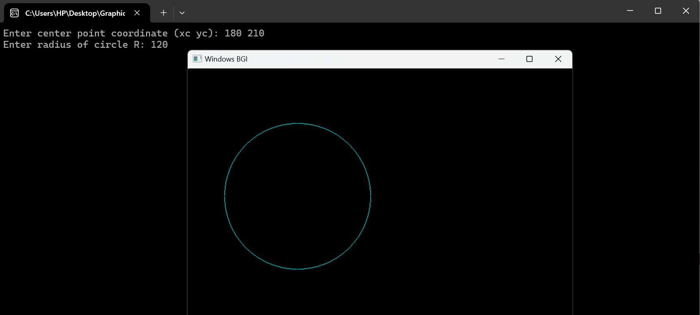

# Mid Point Circle Drawing Algorithm

The **Digital Differential Analyzer (DDA)** algorithm is one of the simplest line-drawing algorithms. Given the starting and ending coordinates of a line, DDA can efficiently compute the intermediate points to draw the line.

## Algorithm Overview

### Given:
- Center coordinates: (Xc, Yc)

- Radius: R

---

### Step 1: Initialize Values

Set the starting point at the top of the circle:

- X = 0

- Y = R

---

### Step 2: Clculate the initial value parameter.
- P = 1 - R

---

### Step 3: Decision Parameter Cases

Suppose the current point is `(X, Y)`, and we want to find the next point. The following cases apply based on the value of the decision parameter P:

### Case 1: If `P < 0`
- `X = X + 1`

- `P = P + 2 * X + 1`

### Case 2: If `P ≥ 0`
- `X = X + 1`

- `Y = Y - 1`

- `P = P + 2 * X - 2 * Y + 1`

---

### Step 4: Plot Symmetrical Points

For each `(X, Y)` calculated, plot the 8 symmetric points using the center `(Xc, Yc)`:

- `(Xc + X, Yc + Y)`

- `(Xc - X, Yc + Y)`

- `(Xc + X, Yc - Y)`

- `(Xc - X, Yc - Y)`

- `(Xc + Y, Yc + X)`

- `(Xc - Y, Yc + X)`

- `(Xc + Y, Yc - X)`

- `(Xc - Y, Yc - X)`

---

## DDA Visualization:

Here is a visual representation of how the DDA algorithm works:

---

## Documentation:

For a more detailed explanation of the DDA algorithm, check out the full documentation:

[Click here for Documentation]()

